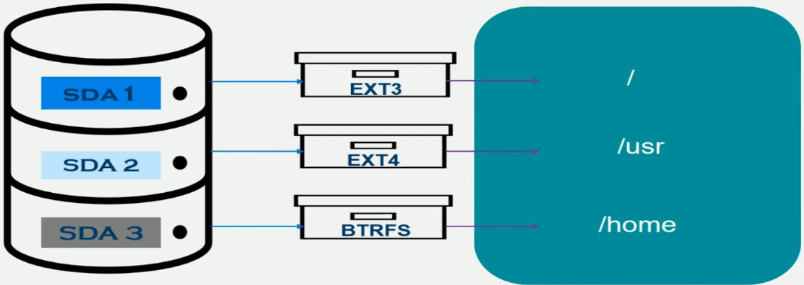

# Containers under the hood

[Linux terminal cheat sheet](https://kapeli.com/cheat_sheets/screen.docset/Contents/Resources/Documents/index);

[JavaScript.Ninja Docker: глубокое погружение](https://www.youtube.com/watch?v=v_GbcTpMTLE&list=PLvTBThJr861x2qFBVwOlqIrbaft-Im-0u);

## BASH and FS


To use autocomplition from history press `Ctrl + R`.

```bash
# you can change in .bashrc the default size of history
echo $HISTSIZE

basedir ./my.txt
# >> my.txt

dirname ./my.txt
# >> /home/myuser/documents

# list all in current directory without ls command
echo *
type echo
# >> echo is a shell builtin

# nl - came as cat, but prints number lines
nl MyClass.java

# 1 - std out
# 2 - std err
ls /someFile 1> stdout-file.txt # 1 (std out) is default option and can be skipped
ls /nonExistentFile 2> error-file.txt
ls 1> result.txt 2> erros.txt

# save both std out and err to one file
ls &> log.txt

# show disk useage regursively for a dir
du -ha Desktop/containers-under-the-hood/

# show file metadata
stat -x filename.txt
```

## Metadata

There are usuful commands to locate executables and regurar files:


`type` also describes aliases.

### Inode table

In fs everything is a file.


 Each file has metadate stored in inode table:


With each `indirect_3` column, the size of the file increases exponentially.

Soft link `ln -s` has a different Inode number and stores the reference(absoule path) to the original file. Hard link is just an alias for a file and it has the same Inode number as original file, however, hard link cannot be created for a directory!

### File Permissions


;

```bash
# Add exec permission to the user
chmod u+x myfile

# remove exec persmission from group and other
chmod go-x myfile

# Set permisson read to other
chmod o=r myfile

# Set read and exec permissions to user and group
chmod 550 myfile
```

;

### Namespaces


;

## PID namespaces

All processes information is accessible via proc file system.

```bash
# list all processes
ls /proc

# list all namespaces
lsns

# list namespaces of type pid
lsns -t pid
# >>         NS TYPE NPROCS   PID USER COMMAND
# >> 4026531836 pid      90  3563 ykov /lib/systemd/systemd --user

# learn which namespace a process 18567 belongs to
readlink /proc/18567/ns/pid
# >> pid:[4026531836]
```

;

### Create a new pid namespace

```bash
# create a new pid namespace (-p) and fork a new bash process (-f)
# --mount-proc creates and mounts a new proc file system
sudo unshare -pf --mount-proc bash
# now you are in a new child ns

ls /proc
# >> 1 # correponds to bash
# >> 10 # corresponds to ls

ps ax
# >>    PID TTY          STAT    TIME  COMMAND
# >>      1 pts/1        S       0:00  bash
# >>      2 pts/1        R+      0:00  ps ax
```

child namespace does not see processes from a parent, but parent **can** see all the child processes. Parent uses a unique set of IDs to track all processes in children namespaces.

;

### Enter child namespace

Since a parent namespace sees all the processes in child namespaces, you can use `nsenter` command

```bash
# In the parent ns
ps ax | grep alice_ps
# >> 4585 ......

# target process which ns you want to enter (-t) specifically pid ns (-p). -r means that you want to run a command in a context of a child ns
sudo nsenter -t 4585 -p -r ps ax

sudo nsenter -t 4585 -p -r top
```

;

## Mount namespaces

Taking a data on a device and laying it onto directory is called mounting and the directory it is mounted onto is called mounting point.



;


;

You can find a mount point corresponding to the root directory:

```bash
findmnt /
# >> TARGET SOURCE                    FSTYPE OPTIONS
# >> /      /dev/mapper/vgubuntu-root ext4   rw,relatime,errors=remount-ro
```

When you take a `dir2` and superimpose it onto `dir1` directory, `dir1` becomes a mount point. All the content of `dir1` will be hidden, and instead you'll see `dir2` content.

To list all the existent mount points:

```bash
df -a
# >> Filesystem                1K-blocks      Used Available Use% Mounted on
# >> sysfs                             0         0         0    - /sys
# >> proc                              0         0         0    - /proc
# >> udev                       16246148         0  16246148   0% /dev
# >> devpts                            0         0         0    - /dev/pts
# >> tmpfs                       3262632      2604   3260028   1% /run
```

Creating a mount point is rather easy:

```bash
ls MountDir/
# >> OriginalFile.txt

ls dir_to_mount/
# >> MountExample.txt SuperImposedFile.txt

# Let's superimpose dir_to_mount/ onto MountDir/, turning MountDir/ into a mount point
sudo mount --bind dir_to_mount/ MountDir/

# check that the mount point was created
df -a | grep MountDir

# now we will see the content of dir_to_mount/
ls MountDir/
# >> MountExample.txt SuperImposedFile.txt

# Let's reverse the mounting
sudo umount -l /home/vinnar/MountDir

ls MountDir/
# >> OriginalFile.txt
```

Let's create a pid namespace and mount namespace together

```bash
cd Potter_Fans_Area/

# -fpm == fork, pid ns, mount ns
#BTW --mount-proc option also creates a new mnt namespace under the hood, so -m is a redundant option in this case.
sudo unshare -fpm --mount-proc bash

# list ns of type pid and mount
lsns -t pid -t mnt
# >>         NS TYPE NPROCS   PID USER COMMAND
# >> 4026531836 pid       2     1 root bash
# >> 4026531841 mnt       2     1 root bash
```

however, though you created a new `pid` and `mnt` namespaces, it still inherits all the mount points from the parent.

You need to use `pivot_root` command to confine a process to a specific directory. If we call `pivot_root` without creating a separate mount namespace, it'll affect all the system. Also, `pivot_root` expects a mount point, not just a regular directory.

```bash
cd ..

# superimpose a directory onto itself
sudo mount --bind Potter_Fans_Area/ Potter_Fans_Area/

cd Potter_Fans_Area/

# create a directory for the old root
mkdir old_root

# make the current directory a new root and copy the content of the current root to old_root dir
pivot_root . old_root/

# fix path
PATH=/usr/bin/:$PATH

# now the root points to Potter_Fans_Area dir
ls / 
# >> PotterFans.txt ....
```

;

## Network namespaces


`lo` - loopback interface that a kernel provides (not a physical device) that allows communication among different services all running on the same host.

```bash
# list network devices
ip link list
# >> 1: lo: <LOOPBACK,UP,LOWER_UP> mtu 65536 qdisc noqueue state UNKNOWN mode DEFAULT group default qlen 1000
# >>     link/loopback 00:00:00:00:00:00 brd 00:00:00:00:00:00
# >> 2: enp0s31f6: <NO-CARRIER,BROADCAST,MULTICAST,UP> mtu 1500 qdisc fq_codel state DOWN mode DEFAULT group default qlen 1000
# >>     link/ether 48:9e:bd:4e:d0:e0 brd ff:ff:ff:ff:ff:ff
# >> 3: wlp0s20f3: <BROADCAST,MULTICAST,UP,LOWER_UP> mtu 1500 qdisc noqueue state UP mode DORMANT group default qlen 1000
# >>     link/ether 10:3d:1c:9f:45:ca brd ff:ff:ff:ff:ff:ff
# >> 4: gpd0: <POINTOPOINT,MULTICAST,NOARP> mtu 1500 qdisc noop state DOWN mode DEFAULT group default qlen 500
# >>     link/none 
# >> 5: docker0: <NO-CARRIER,BROADCAST,MULTICAST,UP> mtu 1500 qdisc noqueue state DOWN mode DEFAULT group default

# list ip table rules
sudo iptables --list-rules
# >> P INPUT ACCEPT
# >> -P FORWARD DROP
# >> -P OUTPUT ACCEPT
# >> -N DOCKER
# >> -N DOCKER-ISOLATION-STAGE-1
# >> -N DOCKER-ISOLATION-STAGE-2
# >> -N DOCKER-USER
# >> -A FORWARD -j DOCKER-USER
# >> .....

# list routing entries
ip r
# >> default via 192.168.0.1 dev wlp0s20f3 proto dhcp metric 600 
# >> 169.254.0.0/16 dev wlp0s20f3 scope link metric 1000 
# >> 172.17.0.0/16 dev docker0 proto kernel scope link src 172.17.0.1 linkdown 
# >> 172.18.0.0/16 dev br-bc10598a2fa7 proto kernel scope link src 172.18.0.1 linkdown 
# >> 172.19.0.0/16 dev br-a968c616b0a5 proto kernel scope link src 172.19.0.1 linkdown 
# >> 172.20.0.0/16 dev br-a0af29fbd83b proto kernel scope link src 172.20.0.1 linkdown 
# >> 172.21.0.0/16 dev br-b1024cbe7839 proto kernel scope link src 172.21.0.1 linkdown 
# >> 172.23.0.0/16 dev br-8b4357ed6986 proto kernel scope link src 172.23.0.1 linkdown 
# >> 172.25.0.0/16 dev br-b6a197831d9f proto kernel scope link src 172.25.0.1 linkdown 
# >> 172.26.0.0/16 dev br-0380bfece604 proto kernel scope link src 172.26.0.1 linkdown 
# >> 172.29.0.0/16 dev br-42b39b29a3c1 proto kernel scope link src 172.29.0.1 linkdown 
# >> 192.168.0.0/24 dev wlp0s20f3 proto kernel scope link src 192.168.0.106 metric 600 
# >> 192.168.160.0/20 dev br-bf04fea4474e proto kernel scope link src 192.168.160.1 linkdown

# create a new pid and network ns, it only gives you loopback interface
sudo unshare -pn --fork --mount-proc bash

#  and it won't have routing table
ip r
# >> Error: ipv4: FIB table does not exist
```

;

## UTS and IPC namespaces

UTS namespace - hostname namespace;

IPC - processes message queue namespace;

```bash
# create a new pid, net, ipc, and uts namespaces; fork proccess
sudo unshare -fpiu --mount-proc bash

# change hostname
hostname Yellowstone

# create processes msg queue (IPC make queue)
ipcmk -Q

# list available queues in this ns
ipcs -q
# >> ------ Message Queues --------
# >> key        msqid      owner      perms      used-bytes   messages    
# >> 0x000003e9 0          ykov       600        0            0
```

;


## User namespaces

UID map is process specific

```bash
sudo cat /proc/$$/uid_map
# >> [sudo]  password  for  vinnar
# >>              0         0    4294967295
```

The main idea, is that we want to make a user inside a ns root (id 0), but if the user espaces ns, they should be mapped to a non-root user on host.

```bash
# creates User namespace. For user ns sudo NOT required
unshare -U bash

# nobody@my-Virt:~/Docker_Examples/Python-docker-example$
id
# >> uid=65534(nobody) gid=65534(nogroup) groups=65534(nogroup)

# 65534 is a special ID reserved for nobody

# learn nobody's process
echo $$
# >> 6966

# execute as nobody
cat / proc/$$/uid_map
# >>

# execute as a root, add uid_map for nobody's process
# 1001 is a real user ID. It should exists!
sudo echo "0 1001 1" > /proc/6966/uid_map

# execute as nobody
id
# >> uid=0(root) gid=65534(nogroup) groups=65534(nogroup)

# the same mechanism can be done for the group - gid_map
```

;


## Overlay FS


;

```bash
# create an overlay fs and mount it onto merded_dir/
# * workdir is a temp area for internal purpose;
# * upperdir is a mutable layer;
# * lowerdir - a list of lower directories, immutable;
# * none - means no underlying device
sudo mount -t overlay -o lowerdir=lower_dir/:lower_dir-2/:lower_dir-3/,upperdir=upper_dir/,workdir=work_dir/ none merged_dir/

# to unmount 
sudo umount -l merged_dir/
```

Now if you make any changes to the files in `merged_dir/` , then "copy on write" changes will be made to `uppder_dir/`  and the lower directories won't be changed. In this example, file `ll2.txt` was removed from the `merged_dir/` and marked as deleted in `uppder_dir/`.


;

### Overlay FS and namespaces together

```bash
sudo su

mount -t overlay -p lowerdir=alpine_dir/:Potter_Fans_Ameneties/:potter_fans/lower_dir,upperdir=potter_fans/upper_dir,workdir=potter_fans/work_dir/ none potter_fans/merged_dir/

# process, mount, UTS, IPC, network
unshare -pmuin --fork --mount-proc bash

# make sure old_root dir exists
mkdir old_root

pivot_root . old_root

PATH=/usr/bin/:$PATH
```

;

## C groups


;

Mem hogger app:

```python
import time

f = open('/dev/urandom', 'r')
rand_data = ""

i = 0
one_MB = 1024 * 1024
while True:
    rand_data += f.read(one_MB)
    i += 1
    print("Number of Bytes read %dMB", %i)
    time.sleep(9)
```

### Memory resource

```bash
sudo su

# create memory group with name mem_limiter
cgcreate -g memory:mem_limiter

# verify that mem_limiter was created
ls /sys/fs/cgroup/memory/

# set memory limit in bytes for the created group
cgset -r memory.limit_in_bytes=15M mem_limiter

# verify that it was set
cat /sys/fs/cgroup/memory/mem_limiter/memory.limit_in_bytes
# >> 15728640

# also we need to control disk swap
cgset -r memory.memsw.limit_in_bytes=15M mem_limiter

cat /sys/fs/cgroup/memory/mem_limiter/memory.memsw.limit_in_bytes
# >> 15728640

# it's kinda misleading, but the limit not is 15M, not 30;
# memory+memsw == 15M

# Let's run the app with the created group
cgexec -g memory:mem_limiter python mem_hogger.py
# >> Number of Bytes read 1MB
# >> ....
# >> Number of Bytes read 11MB
# >> Killed

# it consumed less than 15M because in itself python loads some libs

# you can monitor how much memory is being used by the group
cat /sys/fs/cgroup/memory/mem_limiter/memory.usage_in_bytes
# >> 9850880

# OOM control
cat /sys/fs/cgroup/memory/mem_limiter/memory.oom_control
# >> oom_kill_disable 0
# >> under_oom 0
# >> oom_kill 1

# You can create new namespaces under cgroups
cgexec -g memory:mem_limiter unshare -fp --mount-proc 
```


### CPU resources

Here is an example for the CPU hogger:

```python
def math_func():
    i=0
    while(True):
        i += 1;
        i**i

math_func()
```


#### CPU quotas

Let's create some CPU quotas

```bash
sudo su

# create a new cpu group cpu_limiter1
cgcreate -g cpu:cpu_limiter1

# quota in microseconds, -1 means not set
cat /sys/fs/cgroup/cpu/cpu_limiter1/cpu.cfs_quota_us
# >> -1

# period in microseconds
cat /sys/fs/cgroup/cpu/cpu_limiter1/cpu.cfs_period_us
# >> 100000

# let's allocate 25_000 mks for each 100_000 mks of processor time (25%)
cgset -r cpu.cfs_quota_us=25000 cpu_limiter1

# start a process with the created group
cgexec -g cpu:cpu_limiter1 python cpu_hogger1.py &

# you can monitor and dynamically change the cpu quota
htop

# lower the cpu quota to 10%
cgset -r cpu.cfs_quota_us=1000 cpu_limiter1
```


#### CPU shares

The limit is enforced only when there are compiting processes (otherwise, all CPU available). 

```bash
sudo su

cgcreate -g cpu:cpu_limiter1
cgcreate -g cpu:cpu_limiter2c

# value 1024 means that the process can get max CPU time if no other compiting processes are present
cat /sys/fs/cgroup/cpu/cpu_limiter1/cpu.shares
# >> 1024

cat /sys/fs/cgroup/cpu/cpu_limiter2/cpu.shares
# >> 1024

# set to 75%
cgset -r cpu.shares=768 cpu_limiter1

# set to 25%
cgset -r cpu.shares=256 cpu_limiter2

cgexec -g cpu:cpu_limiter1 python cpu_hogger1.py &
# >> 7003

cgexec -g cpu:cpu_limiter2 python cpu_hogger2.py &
# >> 7004

# If you run htop to check CPU usage, probably, you'll see that both processes consumes ~100% CPU. It's because they run on different cores.
kill -9 7003
kill -9 7004
```

### `cpuset`;

with CPU set you can control the available cores: 

```bash
# create a cpuset
cgcreate -g cpuset:cpu_limiter_set

# specify the available CPU (by idx?) and their cpu memory
cgset -r cpuset.cpus=0 cpu_limiter_set
cgset -r cpuset.mems=0 cpu_limiter_set

# lunch 2 processes with the same cpu set bu difference cpu shares
cgexec -g cpu:cpu_limiter1 -g cpuset:cpu_limiter_set python cpu_hogger1.py &
cgexec -g cpu:cpu_limiter2 -g cpuset:cpu_limiter_set python cpu_hogger2.py &

# now cpu_hogger1.py should consume 75% and cpu_hogger2.py - 25% of the SAME core
```

;


## Docker

Docker uses namespaces, overlay FS, and cgroups to build images. For instance, you can look at `workdir`, `lowerdir`, `upperdir`, `mergeddir` with docker inspect command:

```json
{
    "GraphDriver": {
            "Data": {
                "LowerDir": "/var/lib/docker/overlay2/3e2cc64aaff8ef75fbd6d1baa2e588634d72a186fa77e8c3f359adb982ab2e42/diff:/var/lib/docker/overlay2/fa636e2d2a3eb490edc0be86938badc31d1e5cda4dc0a499f1b452bbc19f37d2/diff:/var/lib/docker/overlay2/999b00c12e1ada50f0d782023d9bf26860dc9ef5f3f1d1868967e716dae1bc1d/diff:/var/lib/docker/overlay2/d0e169bb28bfcaa3eebdf8e67f598e30ff3710dec2243b882ca9db2181a66e6b/diff:/var/lib/docker/overlay2/792d8f983880d1e39316e4ccdb4a8adbb5c282c8b73ca0a6cde6a7120141883c/diff:/var/lib/docker/overlay2/a98246e5b5eb60d72a397b107126695e47a1eb165a6138fee2606c8c7b44e9c9/diff:/var/lib/docker/overlay2/c3fcdfa67ef638b15c7bb48d20e9961cb0e4e7d59387dfc0c3c0a37289654bb0/diff:/var/lib/docker/overlay2/3e8e4ba70dd3e740cea5f31d79263e4df728f208c8b8b0b778637d4a0d4a35f6/diff:/var/lib/docker/overlay2/874008f09b4593e2f3dc89107f7a595f56628fb0ed0886778e61d55c28e79518/diff:/var/lib/docker/overlay2/6cdd364eb96b8ba56e6c0f60d8614fe8acbebf86ff6e042d663b5b4ca07856e8/diff:/var/lib/docker/overlay2/50a12bc4f6501d66c8f9b867db08c7bdd1b2cf5ff0ca9f87f906afb213bd1a57/diff:/var/lib/docker/overlay2/b8daccf69a691c762998b747e15bfcb225e4475885407d15bc53b0ecf92052ec/diff:/var/lib/docker/overlay2/811ff09bef34c357311c3c7363d34b58def3548dce2560bba67a6c5e25fe7774/diff",
                "MergedDir": "/var/lib/docker/overlay2/c2d3345800e77780645c816a304c59bfbfc367ed740e28629c60497c7d780e4a/merged",
                "UpperDir": "/var/lib/docker/overlay2/c2d3345800e77780645c816a304c59bfbfc367ed740e28629c60497c7d780e4a/diff",
                "WorkDir": "/var/lib/docker/overlay2/c2d3345800e77780645c816a304c59bfbfc367ed740e28629c60497c7d780e4a/work"
            },
            "Name": "overlay2"
        }
}
```

and you can actually access it on disk:

```bash
sudo ls -la /var/lib/docker/overlay2/811ff09bef34c357311c3c7363d34b58def3548dce2560bba67a6c5e25fe7774/diff
```

Docker commands (mutating) that add a new layer:

* `FROM`
* `ADD`
* `COPY`
* `RUN`

Docker cache gets invalidated after you use any of these commands.

The last mutation command will add data to the `upperdir`. All previous commands are in the `lowerdir` that are stored as a set of intermediate images.

Docker makes it easy to control the amount of CPU or memory used

```bash
# docker under the hood creates a cgroup under /sys/fs/cgroup/<cgroup-type>/docker/<some_hash>
docker run --rm -it \\
--memory=255m --memory-swap=255m \\
--cpu-period=100000 --cpu-quota=75000 \\
myimage:0.0.1

# or you can use cpu.shares and cpuset
docker run --rm -it \\
--cpu-shares=512 --cpuset-cpu=0 \\
myimage:0.0.1
```

;

## Kubernetes


### Nested namespaces

We can create a namespace from inside a namespace:

```bash
# create a new pid, mount, UPS, IPC namespaces and fork bash
sudo unshare -fpuim --mount-proc bash

# in another tab, learn the process id of the "unshared" bash
ps -ef
# >> UID   PID   PPID  C  STIME  TTY    TIME      CMD
# >> ...
# >> root  5286  5278  0  02:50  pts/0  00:00:00  unshare -fpuim --mount-proc bash
# >> root  5287  5286  0  02:50  pts/0  00:00:00  bash

# just my hypothesis, since we did fork we should look at the child process of the unshare command - 5286 has child 5287
# -a stands for "enter all namespaces"
sudo nsenter -t 5287 -a

# you can verify that you've entered the correct ns by checking the ns ids both in parent tab, and in the tab from which you've entered ns
lsns

```

after you entered the created ns, you can create a nested pid ns:

```bash
# we kinda simulate pods here, so we are interested only in the pid and mount ns
# other ns should be shared between containers in one pod
unshare -fpm --mount-proc bash
```

And the last step is to do `pivot_root`:

```bash
#from nested ns 1
cd /home/vinnar/pod_examples

ls
# >> container1  container2

cd container1

sudo mount --bind container1/ container1/

pivot_root . old_root/

# fix PATH
PATH=/usr/bin/:$PATH

# mount proc
mount proc /proc -t proc

# the same you can do for the container2 in the nested ns 2
```

If the parent namespace get killed, all the nested ns are killed as well.


### k8s workloads

`ReplicaSet` vs `Deployment`? Deployment encaplsulates `ReplicaSet` and has strategies for rollout and rollback:


;

### k8s workflow


;

Core components of the Control Plane

;


;

### k8s and cgroups

```yaml
---
apiVersion: v1
kind: Pod
metadata:
  name: frontend
spec:
  containers:
  - name: memory_hogger
    image: images.my-company.example/memory_hogger:v4
    resources:
      requests:
        memory: "64Mi"
        cpu: "250m" # m - stands for milli CPU, so here we start with 250/1000 -> 25% CPU
      limits:
        memory: "128Mi"
        cpu: "500m"
  - name: log-aggregator
    image: images.my-company.example/log-aggregator:v6
    resources:
      requests:
        memory: "64Mi"
        cpu: "250m"
      limits:
        memory: "128Mi"
        cpu: "500m"
```

Under the hood k8s relays on the plain old cgroups:

```bash
ps -ef
# >> root    9137 ....    python ./memory_hogger.py

cat /proc/9137/cgroup | grep memory
# >> some hash name for the created cgroup
```

;